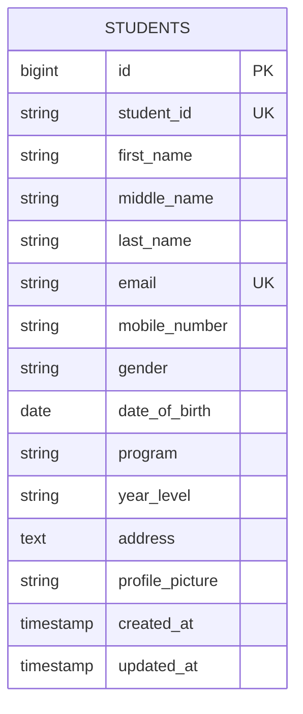
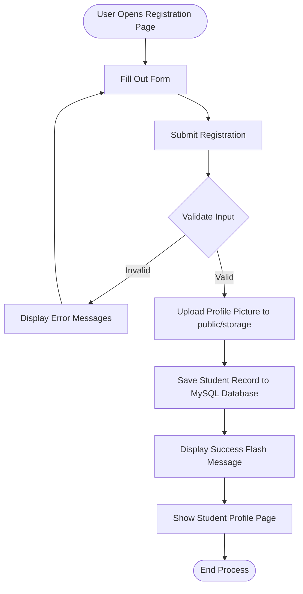
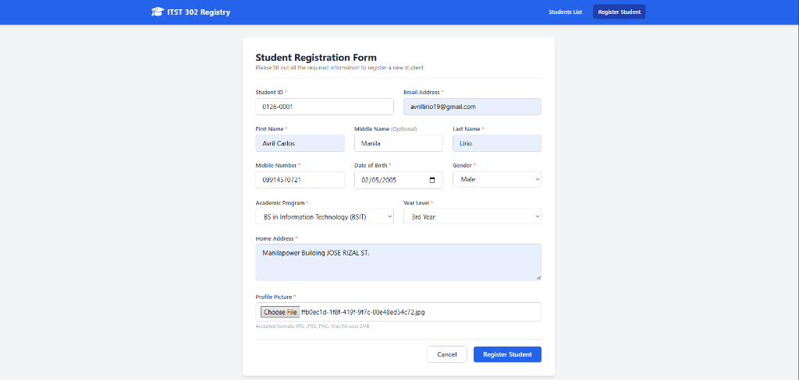
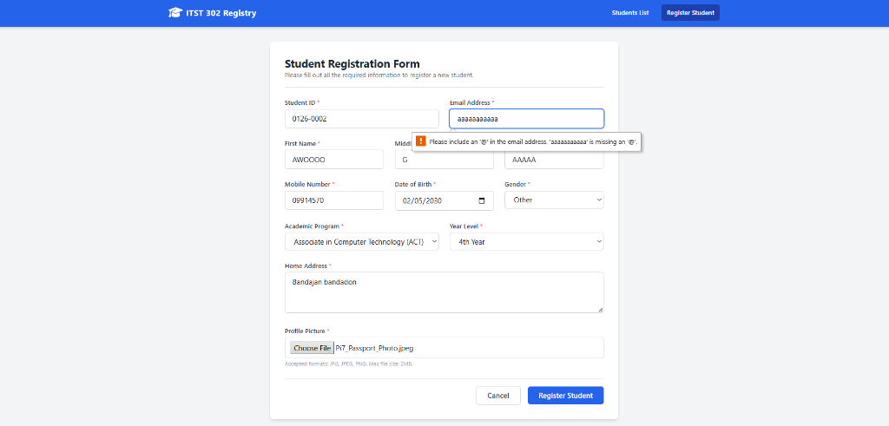
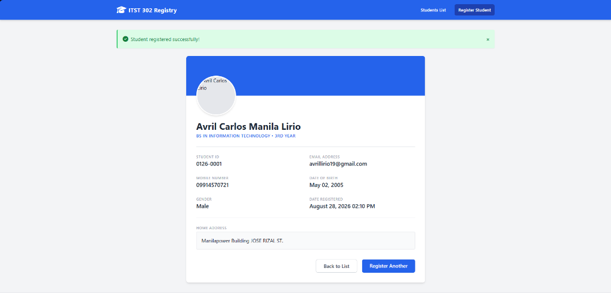
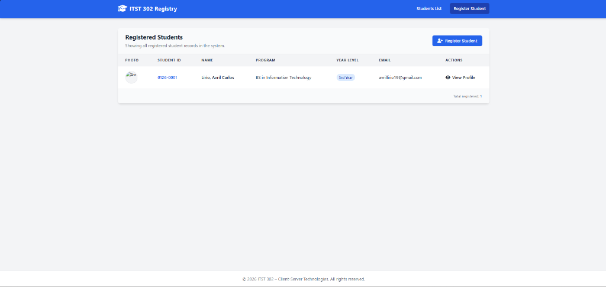

# Student Registration System (MP03)
**Course:** ITST 302 – Client-Server Technologies (Week 4 Laboratory Activity)

---

## 1. Project Title
**Mini Project 03: Student Registration System with Laravel Forms, Validation, and File Upload**

---

## 2. Introduction
In modern enterprise applications, user and student registration is a cornerstone module. The purpose of this Student Registration System is to digitize the paper-based registration process of the College of Information Technology. It enables secure, automated registration of student profiles, manages server-side validations, securely handles document/profile uploads, and establishes a persistent database relationship.

### Importance of Data Validation
Data validation ensures the integrity, accuracy, and security of the database. Without validation, database systems risk receiving malformed entries, duplicate primary/unique identifiers, and potential security vulnerabilities such as SQL injection or cross-site scripting (XSS). Server-side validation acts as a final wall of defense that safeguards application databases.

### Role of Registration Systems in Enterprise Applications
Enterprise registration systems act as portals for user onboarding. These systems are integrated with access control lists (ACLs), mailing list triggers, and other enterprise systems. Correctly structuring the registration flow ensures smooth cross-departmental operations and solid security compliance.

---

## 3. Objectives
Upon completion of this project, the following learning outcomes were achieved:
- Developed responsive HTML forms using Blade templates.
- Configured and handled Laravel routes and controller request pipelines.
- Implemented robust server-side validation rules.
- Handled secure image file uploads using Laravel's file storage disk system.
- Created symbolic links linking private storage partitions to public-facing assets.
- Designed database tables and ran migrations using PHP Artisan.
- Authored comprehensive technical documentation in Markdown.

---

## 4. Laravel Request Lifecycle

```mermaid
graph TD
    A[Browser / Client Request] -->|Sends POST /students| B(routes/web.php)
    B -->|Routes Request| C[StudentController@store]
    C -->|Executes Validation Rules| D{Valid Request Data?}
    D -->|No: Redirects Back with Errors| E[Browser / Old Inputs]
    D -->|Yes| F[Storage: Upload Profile Picture]
    F -->|Stores Image path| G[Eloquent Model: Student]
    G -->|Inserts Record| H[(MySQL Database)]
    H -->|Saves & Returns Model| I[Redirect to show.blade.php]
    I -->|Flashes Success Notification| J[Render Student Profile View]
```

When a user submits the registration form:
1. **Browser**: The browser packages form fields and sends an HTTP POST request to `/students`.
2. **Route**: The HTTP request is captured by `routes/web.php` and mapped to `StudentController@store`.
3. **Controller**: The controller initiates the request lifecycle by parsing form payloads.
4. **Validation**: The request validates all input parameters (unique student ID, valid email formats, and file criteria). If validation fails, an HTTP redirect response sends the browser back to the form along with old inputs and validation messages.
5. **Model**: Eloquent processes the validated data.
6. **Database**: The model queries and inserts data into the MySQL `students` table.
7. **Response**: The controller redirects the client to the `/students/{id}` view, displaying a successful flash message.

---

## 5. Validation Rules
The following validation rules are implemented:
* `student_id => 'required|unique:students'`: Prevents multiple registrations under the same ID.
* `first_name / last_name => 'required|string|max:100'`: Prevents blank entries and truncates data payloads beyond 100 characters.
* `email => 'required|email|unique:students'`: Ensures email syntax correctness and prevents email reuse.
* `mobile_number => 'required|numeric'`: Filters non-numerical phone entries.
* `date_of_birth => 'required|date'`: Restricts text to valid dates.
* `profile_picture => 'required|image|mimes:jpg,jpeg,png|max:2048'`: Verifies files are valid image extensions and enforces a maximum size of 2MB to protect disk storage resources.

---

## 6. Database Design

### Entity Relationship Diagram (ERD)


### Table Structure & Constraints
- **Primary Key**: `id` (bigint auto-increment).
- **Constraints**: 
  - `student_id` is unique.
  - `email` is unique.
  - `middle_name` is nullable (optional field).
  - All other fields are set as `NOT NULL`.

---

## 7. Flowchart



---

## 8. Screenshots
Here are the screenshots demonstrating the working Student Registration System:

### 1. Registration Form (Filled)


### 2. Form Validation Errors (Invalid Input Handling)


### 3. Successful Registration (Student Profile View & Success Flash Message)


### 4. Registered Students Directory (Index View)

## 9. Reflection
### Importance of Validation
Input validation prevents malicious input from corrupting databases or triggering application errors. By filtering data at the server boundaries, applications can guarantee that stored formats strictly comply with system rules.

### Lessons Learned
This project taught me how Laravel handles the file upload lifecycle. Specifically, storing files in the storage system and referencing them in database schemas using relative paths keeps the database clean and lightweight.

### Benefits of Server-Side Validation over Client-Side Validation
While client-side validation (HTML5 / JS) is good for immediate UI feedback, it can easily be bypassed by turning off JavaScript or using terminal clients like cURL. Server-side validation is absolute and cannot be bypassed, ensuring database safety.

### Importance of File Security in Web Applications
Allowing users to upload files presents a major security risk. Enforcing mime-type verification (e.g. `mimes:jpg,jpeg,png`) prevents attackers from uploading malicious executable scripts (like PHP shell scripts) and executing them on the server.

### Real-World Registration Enterprise Systems
Real-world systems scale these patterns using queue workers, cloud-based storage services (like Amazon S3), and transaction-safe database architectures.

---

## 10. References
* Laravel. (2026). *Laravel Documentation: Request Validation*. Retrieved from https://laravel.com/docs
* Oracle. (2026). *MySQL Reference Manual*. Retrieved from https://dev.mysql.com/doc/
* W3Schools. (2026). *PHP Form Validation*. Retrieved from https://www.w3schools.com/php/php_form_validation.asp
