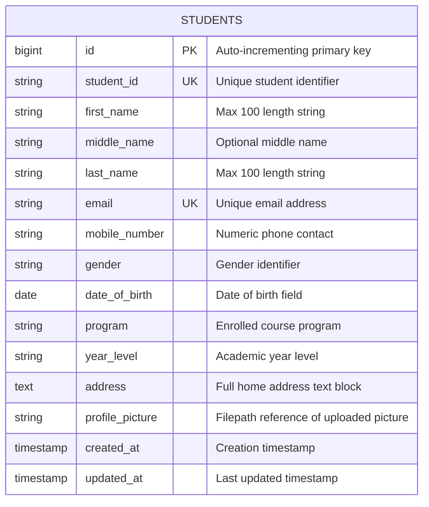

# Database ER Diagram

This diagram displays the table structure and fields of the `students` entity.

```mermaid
erDiagram
    STUDENTS {
        bigint id PK "Auto-incrementing primary key"
        string student_id UK "Unique student identifier"
        string first_name "Max 100 length string"
        string middle_name "Optional middle name"
        string last_name "Max 100 length string"
        string email UK "Unique email address"
        string mobile_number "Numeric phone contact"
        string gender "Gender identifier"
        date date_of_birth "Date of birth field"
        string program "Enrolled course program"
        string year_level "Academic year level"
        text address "Full home address text block"
        string profile_picture "Filepath reference of uploaded picture"
        timestamp created_at "Creation timestamp"
        timestamp updated_at "Last updated timestamp"
    }
```
