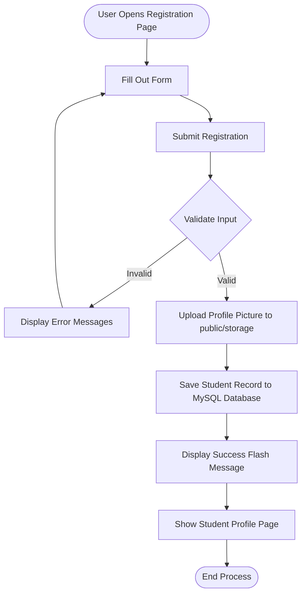

# Registration Flowchart

This diagram illustrates the flow of the student registration process from form entry to profile storage.

```mermaid
graph TD
    Start([User Opens Registration Page]) --> FillForm[Fill Out Form]
    FillForm --> Submit[Submit Registration]
    Submit --> Validate{Validate Input}
    Validate -- Invalid --> ShowErr[Display Error Messages]
    ShowErr --> FillForm
    Validate -- Valid --> UploadImg[Upload Profile Picture to public/storage]
    UploadImg --> SaveDB[Save Student Record to MySQL Database]
    SaveDB --> FlashMsg[Display Success Flash Message]
    FlashMsg --> ShowProfile[Show Student Profile Page]
    ShowProfile --> End([End Process])
```
